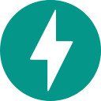
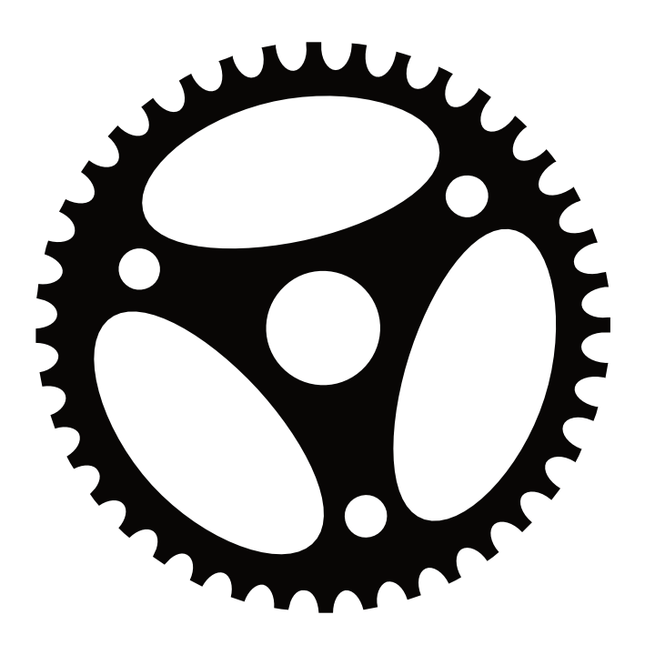

  <h1 style="border-bottom: none;">
    <b>¡Hola! Soy David A. Chentes</b>
  </h1>

  <h3>
    <b>Ingeniero de Software y Desarrollador Back-End</b>
  </h3>

  Convierto ideas en <b>soluciones de software robustas y atractivas</b>. Como desarrollador freelance, me especializo en crear experiencias web a medida que impulsan resultados.

  
  
  

---

### 👨‍💻 Sobre Mí

Como Ingeniero de Software y Desarrollador Back-End, me especializo en la arquitectura y construcción de la lógica del lado del servidor que impulsa aplicaciones robustas y escalables. Mi experiencia abarca desde la gestión remota de sistemas de adquisición de datos, desarrollo de la lógica de negocio para casinos y redes sociales, hasta la creación de ecosistemas de software para CRM. 

He tenido el honor de ser ponente en convenciones científicas y publicar artículos, lo que refleja mi compromiso con la innovación. Como miembro oficial de Ubuntu en Latinoamérica, contribuyo activamente a la comunidad de software libre, una pasión que complementa mi trabajo profesional. 

---

### 🛠️ Tecnologías y Herramientas

  <h4><b>Lenguajes</b></h4>
  

    
    
    
    
    
  

  <h4><b>Frameworks y Librerías</b></h4>
  

    
    
    
    
    
    
    
    
  

  <h4><b>Bases de Datos y Datos</b></h4>
  

    
    
    
    
    
  

  <h4><b>Herramientas y Plataformas</b></h4>
  

    
    
    
    
    
    
    
  

---
